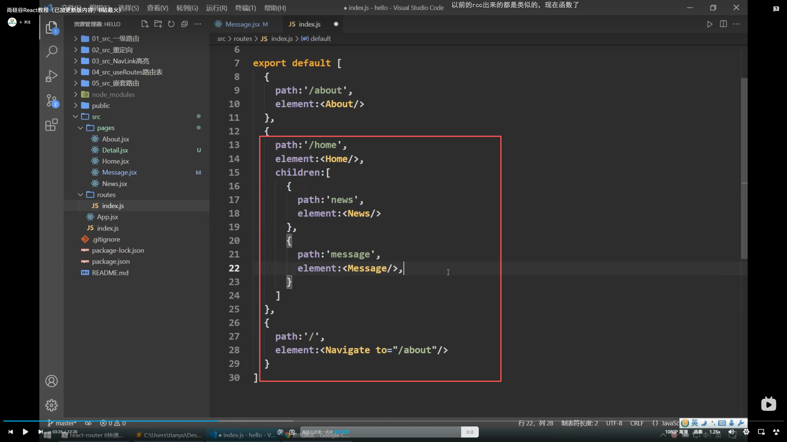
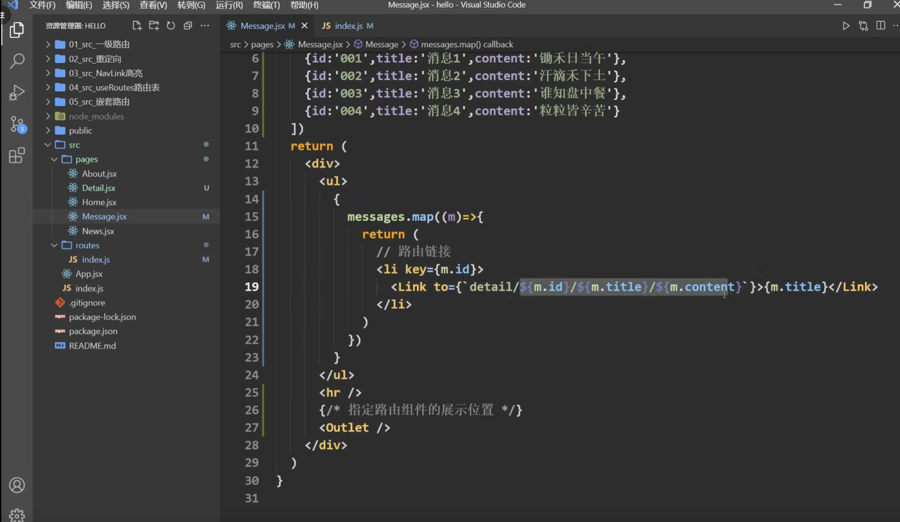
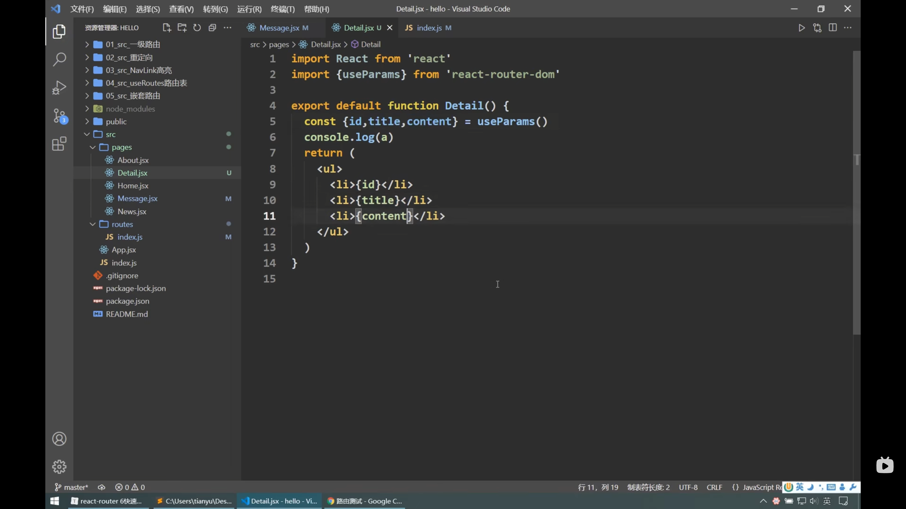
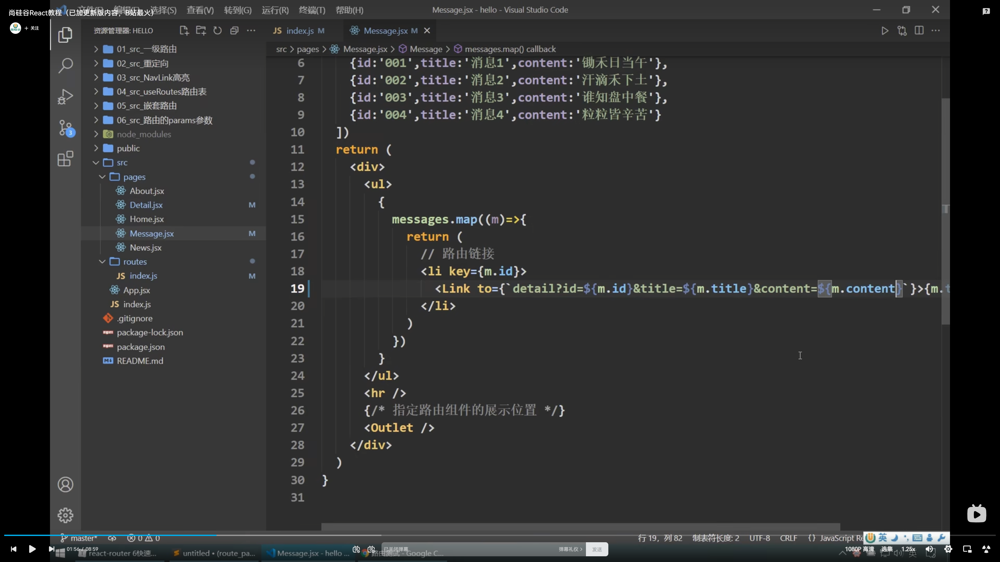
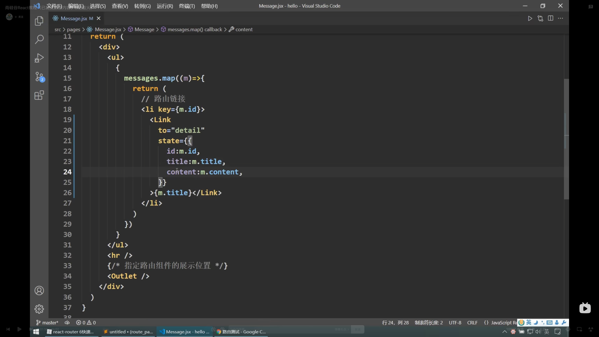
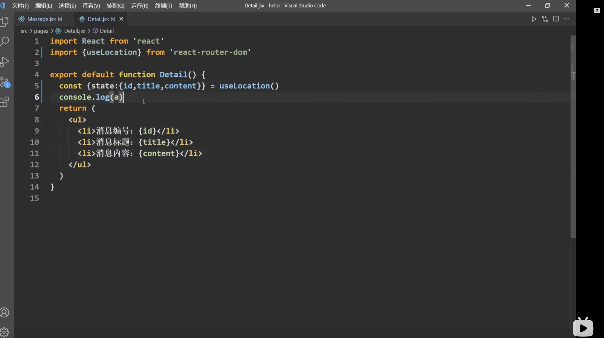

V6嵌套路由的写法：
1.子路由在父级路由里面进行路由注册
2.引入“outlet”进行位置定位。
3.
4.路由统一一个文件管理，子路由在父级路由中注册
5.父组件携带参数传递给子组件
6.子路由在接收params参数时候利用新的hook useParams，进行解构赋值，代入父组件传入的参数
7.父组件传递search参数的写法：，注：路由文件中不用再占位
8.父组件传递给子组件state的参数方法：，子组件接收利用“uselocation”hook去接收